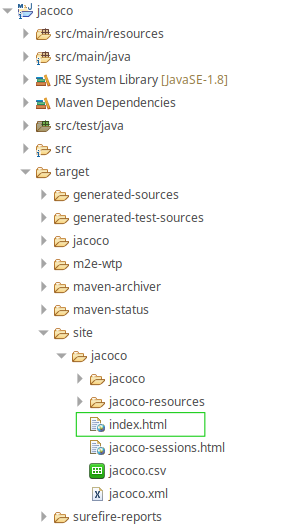
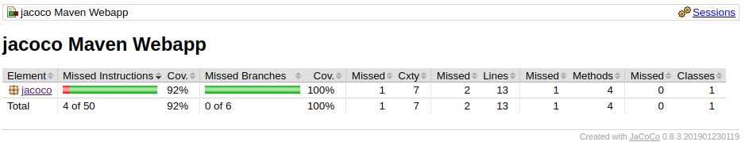
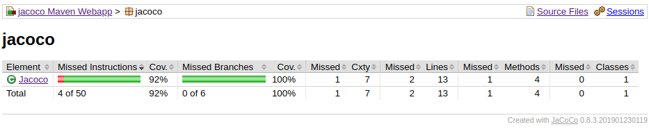
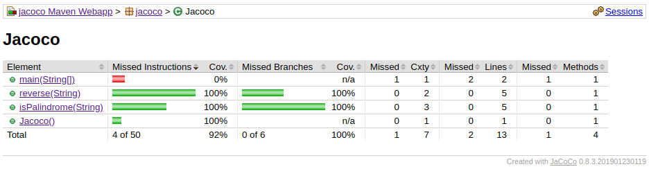

# jacoco prueba de concepto

JaCoCo es una herramienta libre para indicar el cubrimiento de código realizado en los test unitarios (unit test) en JAVA. Creado por EclEmma. Para entender el concepto de cubrimiento de código (code coverage), visita <a href="https://stackoverflow.com/questions/195008/what-is-code-coverage-and-how-do-you-measure-it">what is code coverage andhow-do you measure it</a>.

### Caracteristicas de utilizar JaCoCo
- Realizar análisis de cobertura de instrucciones, ramas, lineas, métodos y complejidad ciclomática del código.
- Integración simple por medio de agente de <a href="https://www.jacoco.org/jacoco/trunk/doc/agent.html">java</a>.
- Compatible con todas las versiones de archivos de clase Java publicadas.
- Se puede user para tareas en Ant y Maven.

Más caracteristicas: <a href="https://www.jacoco.org/jacoco/trunk/doc/mission.html">Misión</a>.

### Uso con maven

JaCoCo plugin es utilizado en las compilaciones de maven. Debe ser incluido en el build de su declaración del pom.xml.

```
<plugin>
  <groupId>org.jacoco</groupId>
  <artifactId>jacoco-maven-plugin</artifactId>
  <version>0.8.3</version>
</plugin>
```

La configuración mínima para el uso de JaCoCo es configurar el las metas prepare-agent y report. La meta report es bueno invocarla durante la ejecución de maven-test. Para más información sobre goals de maven en JaCoCo, visita https://www.jacoco.org/jacoco/trunk/doc/maven.html. El bloque de código que debes agregar al pom es el siguiente:

```
...
<plugins>
  <plugin>
    <groupId>org.jacoco</groupId>
    <artifactId>jacoco-maven-plugin</artifactId>
    <version>0.8.3</version>
    <executions>
      <execution>
        <id>prepare-agent</id>
        <goals>
          <goal>prepare-agent</goal>
        </goals>
      </execution>
      <execution>
        <id>report</id>
        <phase>test</phase>
        <goals>
          <goal>report</goal>
        </goals>
      </execution>
    </executions>
  </plugin>
</plugins>
...
```

Al tener la configuración mínima puede realizar test unitarios para una vez realizados los test, se generan los reportes. Los reportes los encuentra en `target/site/jacoco/index.html`. Al abrir en un navegador se verá un reporte similar al siguiente ejemplo, el cual se compone de todos los packages, las clases y los métodos de los cuales se han realizado los test. 



##### Primer nivel de detalle:


##### Segundo nivel de detalle:


##### Tercer nivel de detalle:



#### La estructura del reporte:
- <b>Element:</b> elemento a cubrir
- <b>Missed Instructions:</b> Instrucciones perdidas, no cubiertas por el test.
- <b>Cov:</b> Porcentaje de cobertura en los test.
- <b>Missed branches:</b> Dentro del código se verifican todos los caminos posibles de la lógica implementada en código.
- <b>Missed:</b> lineas de código no cubiertas por el test en la clase o método.
- <b>Cxty:</b> Complejidad ciclomática del código.
- <b>Lines:</b> Lineas de código cubiertas por el test.
- <b>Methods:</b> Métodos cubiertos por el test.
- <b>Classes:</b> Clases cubiertas por el test.

Ejemplo:

##### Clase Jacoco.java

```java
public class Jacoco {
	
	public boolean isPalindrome(String input) {
		
		if(input == null) {
			throw new IllegalArgumentException("the entry shouldn't be null");
		}
		
		if (input.equalsIgnoreCase(reverse(input))) {
			return true;
		} 
		return false;
		
	}
	
	private String reverse(String input) {
		StringBuilder rever = new StringBuilder();
		String[] inputArray = input.split("");
		for(int i = inputArray.length - 1; i >= 0; i--) {
			rever.append(inputArray[i]);
		}
		return rever.toString();
	}

	public static void main(String[] args) {
		System.out.println("Project executed successfull");
	}
	
}
```

##### jacocoTest.java

```java
public class JacocoTest {

	Jacoco jacoco = new Jacoco();
	boolean expected = true;
	String input = "noon";
	
	@Test()
	public void isPalindromeTest() {
		assertEquals(expected, jacoco.isPalindrome(input));
	}
	
	@Test()
	public void isNotPalindromeTest() {
		assertEquals(false, jacoco.isPalindrome("abc"));
	}
	
	@Test(expected = IllegalArgumentException.class)
	public void isPalindromeExceptionTest() {
		assertEquals(true, jacoco.isPalindrome(null));
	}

}
```

### Más información:

##### <a href="https://www.jacoco.org/jacoco/index.html">JaCoCo Oficial</a> 

##### <a href="https://automationrhapsody.com/automated-code-coverage-of-unit-tests-with-jacoco-and-mav">Automation Rhapsody</a> 


